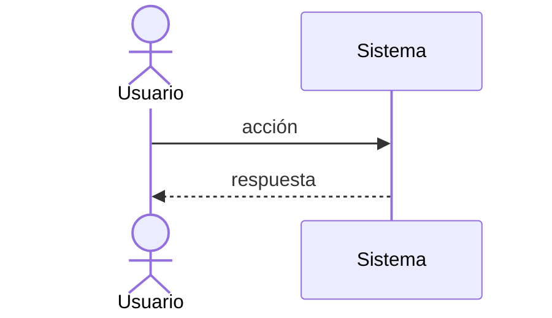

# Flujo · Nombre

## Actores

## Precondiciones

## Diagrama

```mermaid
sequenceDiagram
  actor U as Usuario
  participant S as Sistema
  U->>S: acción
  S-->>U: respuesta
```

## Casos alternos y errores

## Postcondiciones
